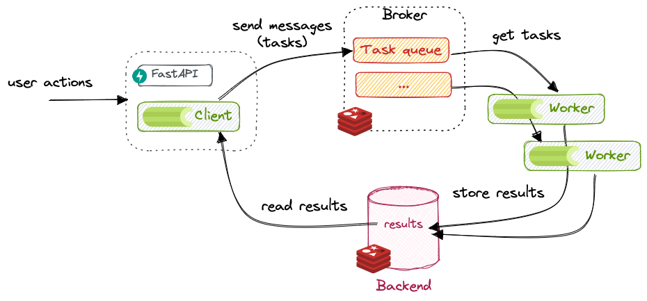

# Настройка и запуск изолированного приложения Celery, которое взаимодействует с Redis, как брокером и бэкендом



Параметры конфигурации, такие как хост `Redis`, порт, пароль и базовый URL, загружаются из файла `.env` с использованием библиотеки `pydantic_settings`

**Пример полностью изолированного `Cellery` приложения от `FastApi`**. **Есть возможность запуска**.

### Основные элементы

1. **Настройка переменных среды с помощью Pydantic:**

- `BaseSettings` помогает загружать конфигурацию из `.env` файла.
- Ключевые параметры (`REDIS_PORT`, `REDIS_PASSWORD`, `REDIS_HOST`) извлекаются из этого файла.

2. **Инициализация Celery:**

- Приложение `Celery` инициализируется с использованием `Redis`, как брокера (`broker`) и хранилища результатов (`backend`).
- SSL-опция `ssl_cert_reqs: ssl.CERT_NONE` отключает проверку сертификатов для защищённых соединений Redis (`rediss://`).

3. **Изоляция:**

- Приложение Celery независимо и может быть запущено без необходимости запуска FastAPI или другого приложения.

### Запуск Celery

Убедитесь, что Redis работает и доступен по указанному адресу.

**Убедитесь, что файл `.env` содержит нужные параметры:**

```dotenv
REDIS_PORT=6379
REDIS_PASSWORD=yourpassword
REDIS_HOST=localhost
BASE_URL=http://localhost:8000
```

**Запустите `Celery` worker:**

```bash
celery -A имя_вашего_файла celery_app worker --loglevel=info
```

Замените `имя_вашего_файла` на имя Python-скрипта.

### Пример использования

**Чтобы приложение стало полноценным, вы можете добавить задачи:**

```python
@celery_app.task
def add(x, y):
    return x + y
```

**Теперь задачу можно отправить так:**

```python
from имя_вашего_файла import add

result = add.delay(4, 6)
print(result.get())  # Выведет 10
```

### Советы

Для продакшена избегайте отключения SSL проверки (`ssl_cert_reqs: ssl.CERT_NONE`).

Убедитесь, что `CELERY_BROKER_URL` и `CELERY_RESULT_BACKEND` защищены.

Для мониторинга задач можно использовать `Celery Flower`.


**Автор:** Дуплей Максим Игоревич

**Дата:** 13.12.2024
